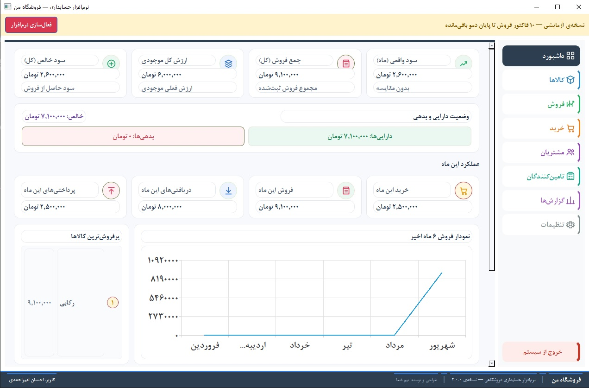

# HesabdariShop

### نرم‌افزار حسابداری و مدیریت فروشگاه

یک راهکار ساده، سریع و کاربردی برای مدیریت امور مالی فروشگاه‌ها و کسب‌وکارهای کوچک

 

 

**حسابداری فروشگاه، ساده‌تر از همیشه**

## 📸 نمایی از نرم‌افزار

## ✨ درباره HesabdariShop

یک نرم‌افزار دسکتاپ برای مدیریت حسابداری و امور مالی فروشگاه‌هاست که با هدف ساده‌سازی عملیات روزمره طراحی شده است.

با استفاده از این نرم‌افزار می‌توانید اطلاعات مالی فروشگاه خود را منظم‌تر مدیریت کنید، تراکنش‌ها را ثبت کنید و دید بهتری نسبت به وضعیت مالی کسب‌وکارتان داشته باشید.

این برنامه برای فروشگاه‌ها، کسب‌وکارهای کوچک و افرادی طراحی شده است که به یک نرم‌افزار حسابداری ساده، کاربردی و قابل‌اعتماد نیاز دارند.

## 🚀 امکانات اصلی

### 📊 داشبورد مالی

- مشاهده نمای کلی وضعیت مالی
- بررسی فروش و خرید
- نمایش مبالغ پرداختی و دریافتی
- مشاهده سود و عملکرد مالی
- نمایش جدیدترین تراکنش‌ها
- بررسی نمودار فروش ماه‌های اخیر

### 👥 مدیریت مشتریان و تأمین‌کنندگان

- ثبت و مدیریت مشتریان
- ثبت و مدیریت تأمین‌کنندگان
- مشاهده بدهی مشتریان
- مشاهده بدهی به تأمین‌کنندگان
- مدیریت بهتر حساب‌های دریافتنی و پرداختنی

### 🛒 مدیریت خرید و فروش

- ثبت تراکنش‌های خرید
- ثبت تراکنش‌های فروش
- مدیریت اطلاعات کالاها
- ثبت مبالغ دریافتی و پرداختی
- دسترسی سریع به سوابق مالی

### 📝 یادداشت‌ها و اعلان‌ها

- ثبت یادداشت‌های مهم
- مدیریت امور روزمره فروشگاه
- نمایش اعلان‌ها و اطلاعات کاربردی

### 🔐 سیستم لایسنس

- ارائه نسخه آزمایشی برای آشنایی با نرم‌افزار
- امکان فعال‌سازی نسخه کامل با لایسنس معتبر
- مناسب برای استفاده شخصی و تجاری

## 🖥️ سیستم موردنیاز

  
| مورد | نیازمندی |
|------|----------|
| سیستم‌عامل | Windows 10 / Windows 11 |
| معماری | 64-bit |
| فضای موردنیاز | حدود 150 مگابایت |
| اتصال به اینترنت | فقط برای بررسی به‌روزرسانی و فعال‌سازی لایسنس |
| نصب Python | موردنیاز نیست |

> این برنامه به‌صورت مستقل اجرا می‌شود و برای استفاده از آن نیازی به نصب Python ندارید.

## 📥 دانلود نسخه آزمایشی

برای دریافت آخرین نسخه نرم‌افزار، به بخش **Releases** مراجعه کنید:

### [⬇️ دانلود آخرین نسخه HesabdariShop](../../releases/latest)

پس از دانلود، فایل نصب را اجرا کرده و مراحل نصب را دنبال کنید.

## 🔑 نسخه آزمایشی و خرید لایسنس

نسخه منتشرشده به‌صورت **Trial** ارائه می‌شود تا بتوانید امکانات نرم‌افزار را بررسی و آزمایش کنید.

برای استفاده کامل از برنامه و دسترسی به امکانات نسخه تجاری، باید لایسنس معتبر تهیه و فعال‌سازی شود.

### چرا لایسنس؟

- فعال‌سازی قانونی نسخه کامل
- پشتیبانی از توسعه و به‌روزرسانی نرم‌افزار
- دریافت نسخه‌های جدید
- استفاده بدون محدودیت‌های نسخه آزمایشی

📩 برای دریافت لایسنس و اطلاعات بیشتر، با سازنده نرم‌افزار در ارتباط باشید.

## 🔄 به‌روزرسانی نرم‌افزار

این دارای قابلیت بررسی نسخه‌های جدید است.

در صورت انتشار نسخه جدید:

1. نرم‌افزار نسخه جدید را شناسایی می‌کند.
2. لینک دریافت نسخه جدید نمایش داده می‌شود.
3. کاربر می‌تواند آخرین فایل نصب را دانلود و نصب کند.

اطلاعات نسخه‌های جدید در بخش **Releases** همین مخزن منتشر خواهد شد.

## 🛡️ امنیت اطلاعات

اطلاعات حسابداری و داده‌های فروشگاه باید با دقت نگهداری شوند.

توصیه می‌شود:

- از اطلاعات مهم خود نسخه پشتیبان تهیه کنید.
- فایل نصب را فقط از منابع معتبر دریافت کنید.
- از انتشار اطلاعات مالی حساس خودداری کنید.
- لایسنس خود را در اختیار دیگران قرار ندهید.

## 🧩 وضعیت پروژه

| بخش | وضعیت |
|------|-------|
| نسخه دسکتاپ ویندوز | ✅ آماده استفاده |
| داشبورد مالی | ✅ فعال |
| مدیریت مشتریان | ✅ فعال |
| مدیریت تأمین‌کنندگان | ✅ فعال |
| ثبت خرید و فروش | ✅ فعال |
| سیستم لایسنس | ✅ فعال |
| بررسی به‌روزرسانی | ✅ فعال |
| نسخه آزمایشی | ✅ ارائه شده |

## 👨‍💻 سازنده

### Ehsan Amirahmadi

توسعه‌دهنده و سازنده HesabdariShop

## ⚠️ توجه

این مخزن برای انتشار نسخه‌های قابل نصب نرم‌افزار و ارائه اطلاعات مربوط به آن ایجاد شده است.

کد منبع پروژه در این مخزن منتشر نشده و فایل‌های ارائه‌شده شامل نسخه اجرایی نرم‌افزار هستند.

### ⭐ اگر HesabdariShop برای شما مفید بود، به این پروژه ستاره بدهید!

**HesabdariShop — مدیریت مالی فروشگاه، ساده و حرفه‌ای**

